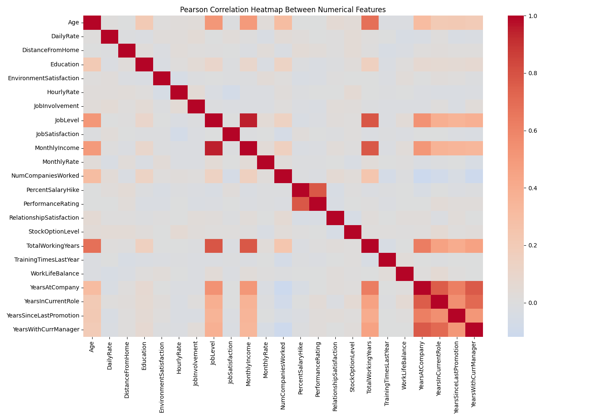
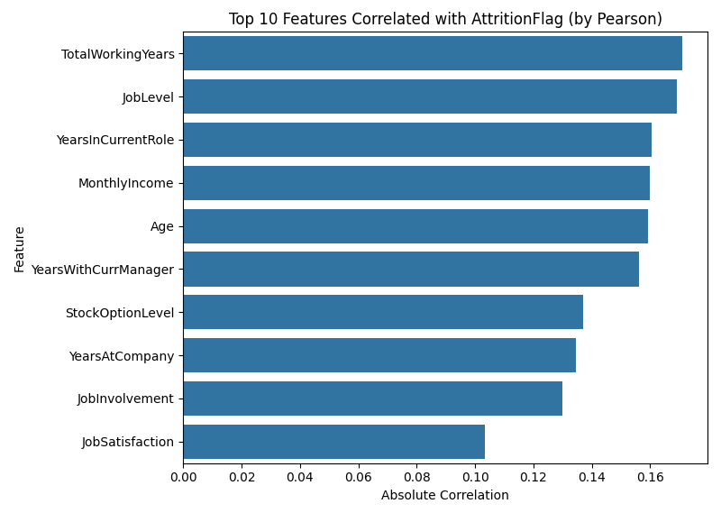
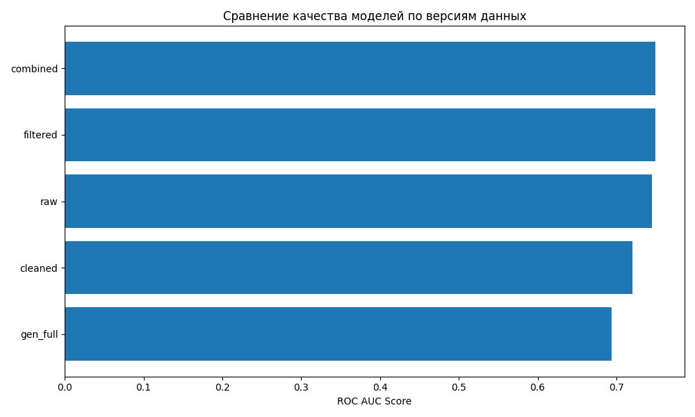
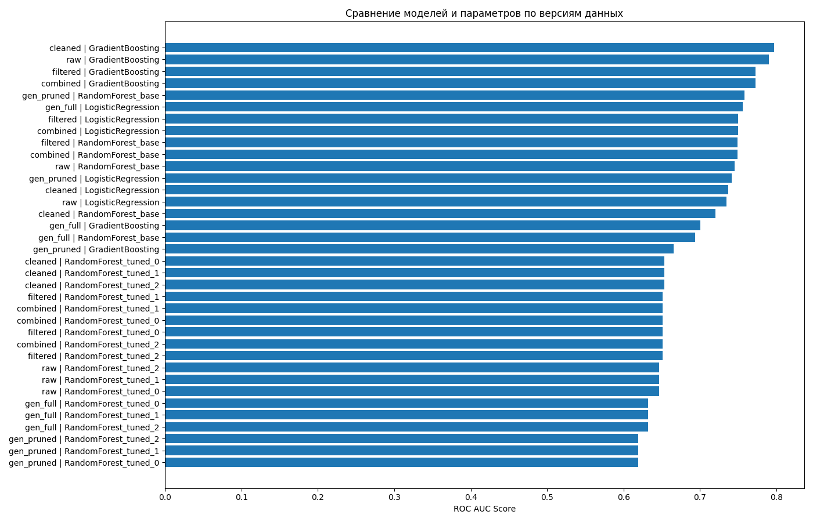

# 📊 Employee Attrition Prediction

Predict employee attrition using structured HR data with classical machine learning models and feature engineering.

---

## 🚀 Overview

This project solves a binary classification problem on a real HR dataset (from IBM) to predict whether an employee will leave the company.

Key ML steps:
- Exploratory Data Analysis (EDA)
- Feature Engineering
- Preprocessing Pipelines
- Model Selection and Evaluation

---

## 🗂 Project Structure

```
├── config.py                     # Model parameter configuration
├── main.py                       # Entry point: compares data versions and models
├── preprocessor.py               # Cleans, transforms, and splits data
├── feature_generator.py          # Generates arithmetic, logical, binned features
├── visualizer.py                 # Correlation & importance visualizations
├── models/
│   ├── random_forest.py          # Random Forest wrapper
│   ├── logistic_regression.py    # Logistic Regression with scaling
│   └── gradient_boosting.py      # Gradient Boosting model
├── images/                          # Output plots for README
├── WA_Fn-UseC_-HR-Employee-Attrition.csv  # Dataset
└── README.md
```

---

## 📈 Pipeline Summary

### 🔹 1. Data Cleaning
- Removed constant/irrelevant columns
- Target label (`Attrition`) encoded to `AttritionFlag`

### 🔹 2. Correlation Analysis
- Visualized pairwise correlations
- Identified highly correlated groups

### 🔹 3. Feature Versioning
Created multiple dataset versions for experimentation:

| Version      | Description                                      |
|--------------|--------------------------------------------------|
| `raw`        | Original dataset                                 |
| `cleaned`    | Dropped constant/irrelevant features             |
| `combined`   | Combined highly correlated features              |
| `filtered`   | Equivalent to combined (reserved for future)     |
| `gen_full`   | Auto-generated arithmetic/logical/binned features|
| `gen_pruned` | Correlation-pruned version (threshold = 0.8)     |

### 🔹 4. Models Used
- ✅ `RandomForestClassifier` (base + tuned variants)
- ✅ `LogisticRegression` (`lbfgs`, scaled)
- ✅ `GradientBoostingClassifier`

### 🔹 5. Evaluation Metric
- **ROC AUC Score** chosen due to class imbalance

---

## 📊 Visual Results

### 🔍 Correlation Heatmap


### 🔍 Top 10 Highly Correlated Features


### 📊 Model RandomForest Performance by Data Version 


### 📊 Final Model Comparison


---

## 🏁 Results

| Version + Model             | ROC AUC Score |
|-----------------------------|---------------|
| `cleaned + GradientBoosting`     | **0.7966**   |
| `raw + GradientBoosting`         | 0.7903        |
| `raw + LogisticRegression`       | 0.7902        |
| `cleaned + LogisticRegression`   | 0.7892        |
| `combined + LogisticRegression`  | 0.7815        |
| `filtered + LogisticRegression`  | 0.7815        |

- GradientBoosting and LogisticRegression show the best results
- `cleaned` and `raw` versions are the most stable


## 📎 Dataset Source
- [IBM HR Analytics Employee Attrition & Performance (Kaggle)](https://www.kaggle.com/datasets/pavansubhasht/ibm-hr-analytics-attrition-dataset)

